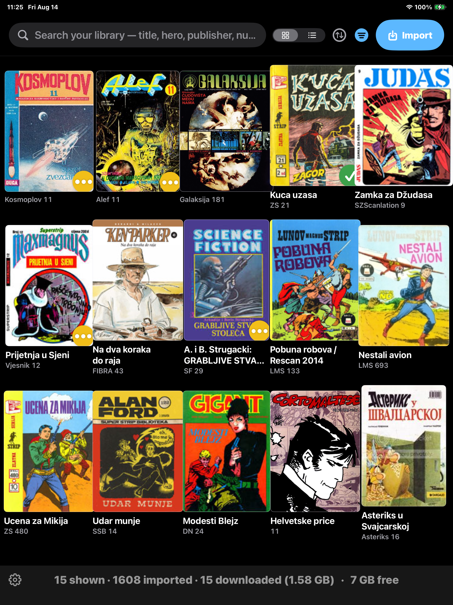

<table><tr>
<th>
  
</th>
<th>
   
  StreamZine 1.0  
  Comics & magazines reader 
  that supports StripZona forum.  
  20. August 2026 
  Now on App Store!  
  <a href="https://apps.apple.com/us/app/streamzine/id6801719481" float="left">
     </a> 
  Coming soon in 1.1: support for 
  RetroSpec, Archive.org and ComicBook+
</th>
</tr>
</table>

## New in 1.2 (work in progress)

* **Added content sources:**

  * **[BombJack](https://commodore.bombjack.org)** — DLH's Archive,
of scanned vintage computer magazines, books and manuals covering
Commodore 8-bit, Amiga, Atari, Apple, MSX, Timex-Sinclair, Oric, Osborne and a dozen more
machines in seven switchable sub-sources: Magazines (Commodore, Amiga,
Other), Books, Hardware Manuals, Video Games-related,
Other (newsletters, applications, advertising). Download individually to read.

  * **[BatCave](https://batcave.biz)** — A large open repository of comics.
Import to browse and fetch metadata and Download to read.

  * **[Stripovi.com](https://www.stripovi.com/index.asp?page=online-comics-frontpage)**
— free Croatian web comics. Switch it on to see the index then  Download individually to read.

* **Bug fixes and various improvements** including: performance optimizations, Source panel enhancements,
honouring server cooldown periods, better square page cover handling.

---

## New in 1.1 (Apple approval in progress)

* **Added content sources:**

  * **[RetroSpec](https://retrospec.elite.org/users/tomcat/yu/revije.php)**, Tomaž Kac's
archive of scanned ex-Yugoslav vintage (1972-2001) computer magazines (Moj Mikro,
Računari, Svet Kompjutera, etc.) and computer books.

  * **[Archive.org](https://archive.org)** - the Internet Archive.
A small embedded index for the ex-Yugoslav Amiga fanzines: Amiga Bilten (Sep & Oct '88)
and A-Profy (Jul & Aug '90) and Import from Archive.org individual item detail pages.

  * **[ComicBook+](https://comicbookplus.com)**, an archive of public-domain
Golden Age comics, pulp magazines, story papers and fanzines. You search/browse for a series,
and Import metadata onto the shelf. To download you need a (free) ComicBook+ account.

  * **All sources can now be switched ON / OFF in Settings.**
Switching a source hides it everywhere but never deletes anything.

* **Browser fencing** All three browser views (StripZona, Archive.org, ComicBook+) are fenced to
their own site. The address line is read-only and links leading outside those domains are not
followed. (It is not a full web browser -- App Store compliance.)

* **Smart Zoom** trims the blank space off so the artwork fills the full screen. Detects
scanner edges, paper margins, and lone page numbers. So magic and unique that is is ON
by default (switchable in Settings).

* **Bug fixes, UI/UX tweaks and additions** including more natural zoom, sort by Recently Open, and
Page Preview Grid.

---

## 1.0 Features

  <a href="https://apps.apple.com/us/app/streamzine/id6801719481" float="left">
     </a>

- **Imports a liked StripZona forum page** and turns its posts into library entries.
- **Finds cover art** from the page itself, or by resolving against stripovi.com.
- **Downloads** from mirrors (MediaFire, Mega, Pixeldrain), including split archives
  and sets where one archive holds a run of issues.
- **Reads** CBR, CBZ, RAR, ZIP, 7z and PDF. Portrait turns pages like Kindle; landscape is
  one continuous fit to width (for oversized content) scroll with a scrubber down each edge, so it works in either
  hand. It remembers where you stopped reading.
- **Search, filter, sort** by title, hero, publisher, series or number, with
  read/reading/unread and downloaded states.

> [StripZona](https://www.stripzona.com) is a Serbian/ex-YU comics fan site. You browse its forum
inside the app, import a topic page, and its issues become a searchable shelf — covers, series,
hero, publisher and issue numbers, all read off the page in a convenient Kindle-style reader.
Downloads and reading happen in the app. You will need a free StripZona account.
[StripZona Support Details](StripZonaSupport.md) (How logging in works, the heroes, series, editions and publishers this has been tested
against, and what happens to a topic written some other way.)

---

[Development Notes](DevNotes.md) (Building and running, test fixtures, shipped indexes, etc.)

---

## StreamZine License

**Content:** there is no content. The app is a reader — it doesn't host, bundle, or ship any content.
Content is downloaded at the user's request from freely accessible sources accessible to any web browser.
Some sources require a free account, created on their own site. Browsing happens in views fenced
to each source's domain — the app is a specialized reader, not a general web browser.

**Code:** Copyright © Mihailo Despotovic, 2026. Licensed under [PolyForm Noncommercial 1.0.0](LICENSE).
* 🟢 **Free to use** for personal, educational, research, and non-commercial projects.
* 🔴 **Commercial use prohibited.** If you intend to use my code in any way in any revenue-generating product, you must contact me for a commercial license.

